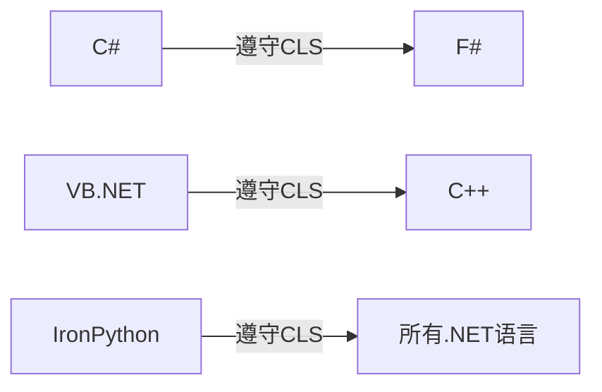
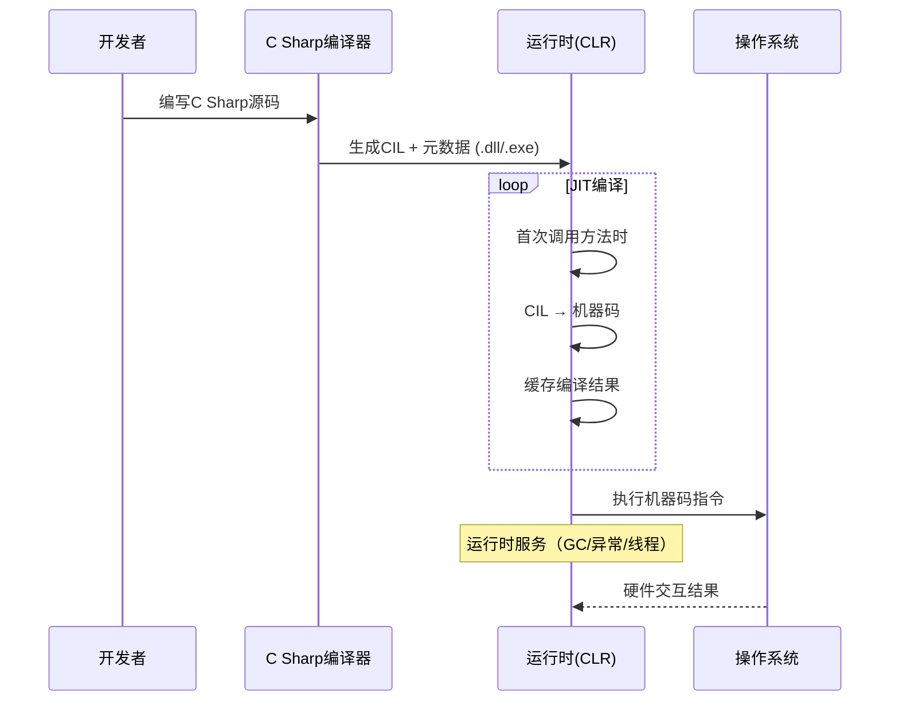

C# 是一款开源且免费的编程语言，基于流行的 C 风格语法（如 C、C++、Java），让开发者可以快速上手。它强大的跨平台能力支持开发多样化的应用，包括桌面软件、Web 应用、移动应用、微服务、物联网设备和游戏主机平台。得益于其开源特性，开发者不仅能自由使用，还能查看、修改源代码，并向社区贡献改进。

## C#语法基础

### 关键字（Keywords）

为了帮助编译器解释代码，C#中的某些单词具有特殊地位和含义，它们称为关键字。关键字分为两类：

- **保留关键字**：如 `class`、`if`、`for`、`void` 等，用于定义程序结构。
- **上下文关键字**：如 `var`、`async`、`await`，仅在特定场景下被视为关键字。

**关键作用**：

- 声明类型（`class`、`struct`、`enum`）
- 控制流程（`if`、`switch`、`while`）
- 定义访问权限（`public`、`private`）
- 处理异常（`try`、`catch`）

**示例**：

```C#
public class Program  // 'public'和'class'为关键字
{
    static void Main() 
    {
        if (true) { }  // 'if'控制逻辑分支
    }
}
```

### 标识符（Identifiers）

标识符是开发者自定义的名称（如变量、类名），规则如下：

- **组成**：字母、数字、下划线`_`或`@`符号（`@`仅用于转义关键字，如 `@class`）
- **开头字符**：字母或下划线（**禁止数字开头**）
- **大小写敏感**：`myVar` 与 `MyVar` 不同
- **命名规范**：标识符有两种基本的大小写风格。第一种风格被.NET框架创建者称为`Pascal`大小写（`PascalCase`），第二种风格是`camel`大小写（`camelCase`），除第一个字母小写，其他约定一样，例如`quotient`、`firstName`、`httpFileCollection`、`ioStream`和`theDreadPirateRoberts`。
  - 类名/方法名 → **PascalCase**（`MyClass`、`CalculateSum()`）
  - 变量/参数名 → **camelCase**（`userAge`、`isValid`）
  - 常量 → **全大写**（`MAX_SIZE`）

> **设计规范**
>
> - 要更注重标识符的清晰而不是简短。
>
> - 不要在标识符名称中使用单词缩写。
> - 不要使用不被广泛接受的首字母缩写词，对于那些已经被广泛接受的缩写词，在使用时也要保持一致。
>
> 下划线虽然合法，但标识符一般不要包含下划线、连字号或其他非字母/数字字符。

**示例**：

```c#
string firstName;    // 变量：camelCase
const int MAX_USERS = 100; // 常量：全大写
class CustomerOrder { }   // 类名：PascalCase
```

### 类型定义

C#所有代码都出现在一个类型定义的内部，最常见的类型定义以关键字`class`开头。类定义是`class identifier {...}`形式的代码块。

类型名称（本例是HelloWorld）可以随便取，但根据约定，它应当使用PascalCase风格。

```c#
class HelloWorld
{
	//...
}
```

### Main方法（Entry Point）

`Main` 是程序执行的起点，必须满足：

- **固定签名**：`static void Main(string[] args)`（`args`可省略）
- **静态方法**：用`static`修饰，无需实例化类
- **唯一性**：每个程序仅允许一个`Main`方法

**示例**：

```c#
using System;
class App
{
    static void Main()  // 入口方法
    {
        Console.WriteLine("Hello, C#!"); 
    }
}
```

C#要求Main方法返回`void`或`int`，而且要么无参，要么接收一个字符串数组。`args`参数是用于接收命令行参数的字符串数组。但数组第一个元素不是程序名称，而是可执行文件名称后的第一个命令行参数，这和C和C++不同。用`System.Environment.CommandLine`获取执行程序所用的完整命令。Main返回的`int`是状态码，标识程序执行是否成功。返回非零值通常意味着错误。从C#7.1开始，Main方法也支持`async/await`修饰词。

```c#
static int Main(string[] args)  // 入口方法
{
    Console.WriteLine($"{args[0]}"); 
}
```

### 语句与语句分隔符

C#通常用分号标识语句结束。每条语句都由代码要执行的一个或多个行动构成。声明变量、控制程序流程或调用方法都是语句的例子。

- 语句（Statements）：程序执行的最小单元，如：
  - **声明语句**：`int x = 5;`
  - **赋值语句**：`x = 10;`
  - **控制流语句**：`if`、`for`、`return`
- 分隔符：
  - **分号 `;`**：标记语句结束（**不可省略**）
  - **大括号 `{}`**：定义代码块（如类体、循环体）[4,5](https://tencent.yuanbao/@ref)

**示例**：

```c#
if (x > 0)           // if条件控制
{                    // 代码块开始
    Console.WriteLine(x);
    return;          // 返回语句
}                    // 代码块结束
```

### 空白（Whitespace）

空白（空格、制表符、换行）用于提升代码可读性：

- **编译器忽略**：不影响程序逻辑（如 `int x=5;` 等同 `int x = 5;`）
- 规范建议：
  - 操作符两侧加空格（`int sum = a + b;`）
  - 逗号后加空格（`Method(arg1, arg2)`）
  - 缩进代码块（通常4个空格或1个制表符）

**对比示例**：

```c#
// 紧凑写法（合法但难读）
int x=5;if(x>0){Console.WriteLine(x);}

// 规范写法
int x = 5;
if (x > 0) 
{
    Console.WriteLine(x);
}
```

## 使用变量

下面声明局部变量。变量声明后可以赋值，可将值替换成新值，并可在计算和输出等操作中使用。但变量一经声明，数据类型就不能改变。


变量就像程序里一个命名好的存储空间，用来存放数据。你可以在程序后续的执行过程中向这个空间赋值或者修改其中的值。

当变量是在某个方法（函数）内部或一对`{}`大括号（代码块）内声明时，它就是局部变量。这意味着局部变量的作用域仅限于它所在的那个代码块内——它只能在声明它的那对大括号`{}`内部使用。

声明一个变量，简单来说就是定义一个新的变量。你需要完成两件事：

1. 指明变量类型：指定这个变量可以存储什么类型的数据（例如整数、小数、文本等）。
2. 赋予变量名称：给这个存储位置起一个唯一的标识符，也就是变量名。

### 数据类型

数据类型（或对象类型）是具有相似特征和行为的个体的分类。例如，animal（动物）就是一个类型，它对具有动物特征（多细胞、具有运动能力等）的所有个体（猴子、野猪和鸭嘴兽等）进行了分类。类似地，在编程语言中，类型是被赋予了相似特性的一些个体的定义。

## 控制台输入和输出

在C#中，控制台输入和输出通过`System.Console`类实现，这是控制台应用程序与用户交互的核心方式。以下是具体实现方法及关键技巧：

### 控制台输出

使用`Console.WriteLine()`或`Console.Write()`向控制台输出信息：

- `WriteLine()`：输出内容后自动换行。

  ```c#
  Console.WriteLine("Hello, World!"); // 输出后换行
  ```

- `Write()`：输出内容后不换行，适合连续输出。

  ```c#
  Console.Write("Enter your name: "); // 输出后不换行
  ```

#### 格式化输出技巧

- 占位符`{n}`：动态插入变量值，支持多参数。

  ```c#
  string name = "Alice";
  int age = 30;
  Console.WriteLine("{0} is {1} years old.", name, age); // 输出：Alice is 30 years old.
  ```

- 字符串插值（C# 6.0+）：更简洁的语法。

  ```c#
  Console.WriteLine($"{name} is {age} years old.");
  ```

- 数字/日期格式化：

  ```c#
  double price = 123.456;
  Console.WriteLine(price.ToString("C2")); // 货币格式：¥123.46
  Console.WriteLine(DateTime.Now.ToString("yyyy-MM-dd")); // 日期：2025-08-05
  ```

### 控制台输入

通过`Console.ReadLine()`或`Console.ReadKey()`获取用户输入：

- `ReadLine()`：读取整行文本（以回车结束），返回`string`类型。

  ```c#
  Console.Write("Enter your name: ");
  string name = Console.ReadLine(); // 用户输入存储到变量name中
  ```

- `ReadKey()`：获取单个按键（无需回车），常用于暂停程序。

  ```c#
  Console.ReadKey(); // 按任意键继续
  ```

- **`Read()`**：读取单个字符，返回ASCII码（如不换行输入）。

### 数据类型转换

输入内容默认为字符串，需转换为目标类型：

- 安全转换（推荐）：使用`TryParse()`避免无效输入导致异常。

  ```c#
  Console.Write("Enter age: ");
  string input = Console.ReadLine();
  if (int.TryParse(input, out int age)) {
      Console.WriteLine($"Age: {age}");
  } else {
      Console.WriteLine("Invalid number!");
  }
  ```

- 强制转换（需异常处理）：

  ```c#
  try {
      int num = int.Parse(input);
  } catch (FormatException) {
      Console.WriteLine("Input format error!");
  }
  ```


直接使用`Convert.ToInt32()`或`int.Parse()`可能因无效输入抛出异常。


### 注释

注释不会改变程序的执行，只是使代码变得更容易理解。

```c#
// 单行注释

/*
	多行
	注释
*/
```

## 托管执行与CLI

在C#生态中，**托管执行**和**CLI（Common Language Infrastructure，通用语言基础结构）** 构成了.NET核心技术架构。以下从技术实现层面进行深度剖析：

### 托管执行（Managed Execution）

#### 核心流程

1. **源代码编译**
    C#代码 → 通过**Roslyn编译器**​ → 生成**CIL（Common Intermediate Language）字节码**​

   ```c#
   // 示例：C#方法
   public int Add(int a, int b) => a + b;
   
   // 对应CIL代码（部分）
   IL_0000: ldarg.0    // 加载第一个参数
   IL_0001: ldarg.1    // 加载第二个参数
   IL_0002: add        // 执行加法
   IL_0003: ret        // 返回结果
   ```

2. **JIT编译阶段**

   - CLR加载程序集时调用**JIT编译器**（如RyuJIT）

   - 方法首次调用时触发编译：

     ```c#
     CIL字节码 → 动态编译 → 本机机器码（x86/ARM等）
     ```

   - 编译结果缓存：避免重复编译

3. **运行时管理**
    CLR提供关键服务：

   - **内存管理**：GC分代回收（0/1/2代）
   - **异常处理**：结构化异常链（SEH）
   - **类型安全**：通过CTS实现边界检查
   - **线程调度**：线程池与同步原语

### CLI（通用语言基础结构）

CLI是ECMA-335国际标准定义的框架规范，包含四个核心组件：

#### CTS（Common Type System）

**解决的核心问题**：跨语言类型兼容性

- **值类型**：`struct`/`enum`（栈分配）
- **引用类型**：`class`/`interface`/`delegate`（堆分配）
- **统一规则**：
  - 所有类型继承自`System.Object`
  - 方法调用统一采用`callvirt`指令
  - 实现接口/继承的二进制兼容

#### CLS（Common Language Specification）

**语言互操作性规范**：



- 强制规则：
  - 公共方法参数/返回值需为CLS兼容类型
  - 不支持全局函数或运算符重载的差异
  - 避免使用`uint`等非通用类型作为API参数


#### VES（Virtual Execution System）

即CLR的标准化实现，包含：

- **加载器**：按需加载程序集
- **JIT引擎**：方法级编译优化
- **内存管理器**：分代GC算法
- **安全子系统**：CAS代码访问安全

#### 元数据（Metadata）

程序集自描述信息的结构化存储：

```c#
// 元数据示例（伪代码）
TypeDef {
   Name: "Customer",
   Methods: [ "Save", "Delete" ],
   Fields: [ "_id", "_name" ]
}
```

- 核心功能：

  - 支持反射API（`Type.GetMethods()`）
  - 驱动Visual Studio智能感知
  - 实现跨程序集版本控制

### 底层执行流程图解



### 技术演进趋势

1. **AOT编译**（.NET 7 NativeAOT）
   - 优点：消除JIT开销，启动时间缩短100倍
   - 代价：失去运行时优化灵活性
2. **托管指针革命**
    C# 11引入`ref struct`突破堆分配限制
3. **跨语言互操作**
    通过[UnmanagedCallersOnly]实现C# ↔ Rust高效调用

> CLR的设计哲学：在硬件抽象与执行效率间取得平衡，使开发者专注于业务逻辑而非底层细节。这种托管模型已成为现代语言的核心范式（如Java JVM、Python PyPy）。
